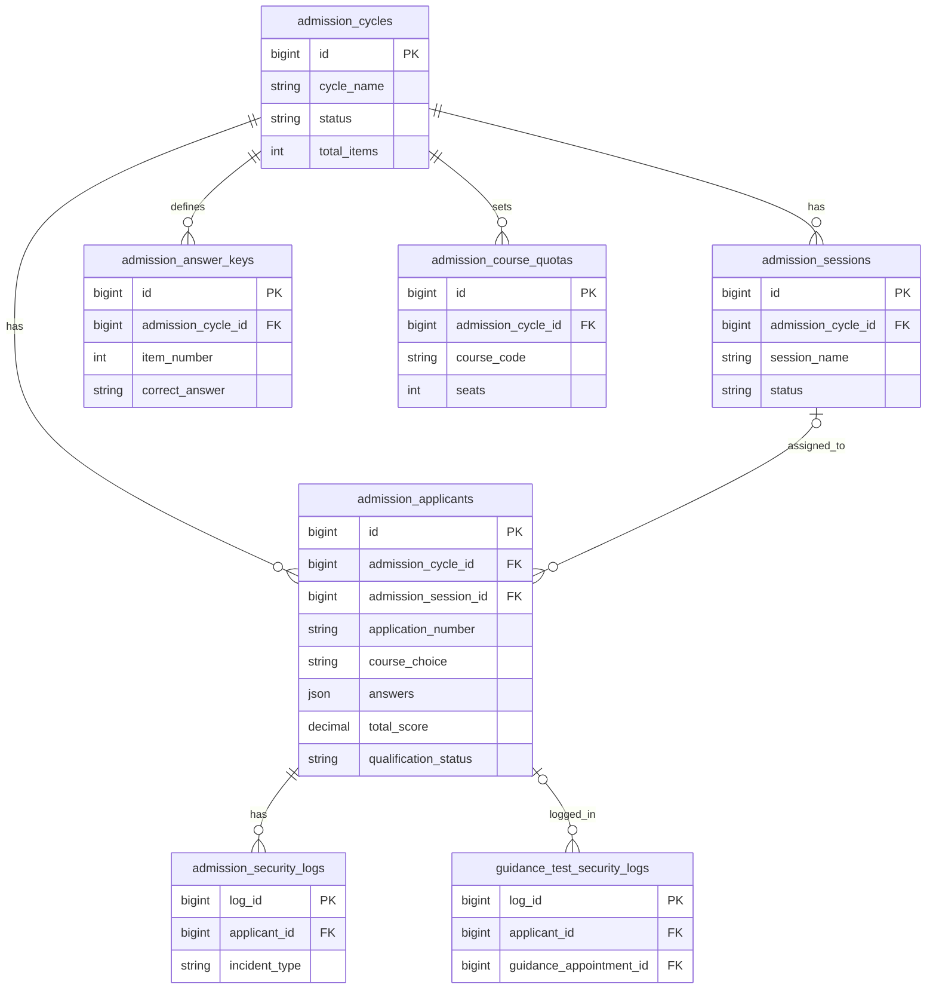
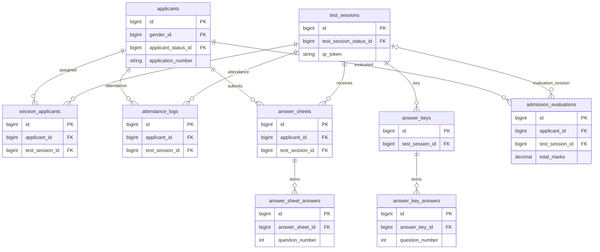
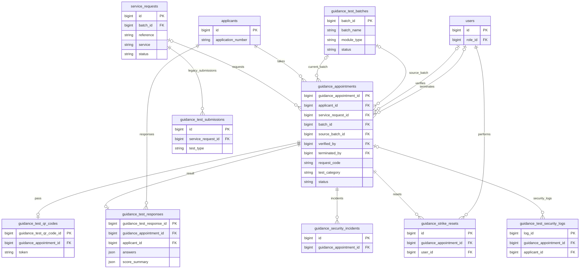
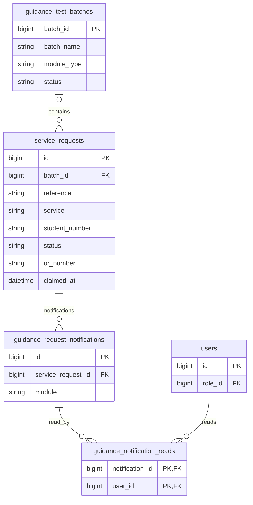
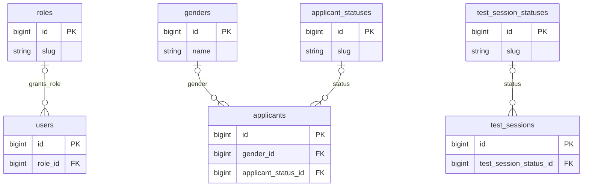

# System ERD guide

This guide maps the business tables in `cap_db (1).sql` (dump generated September 27, 2026). Each relationship line in the diagrams represents a **declared foreign key** in that dump. `||` means one, `o|` means zero or one, and `o{` means zero or many. The fields shown are the keys and a few attributes useful for understanding the workflow; consult the SQL dump for every column and index.

## 1. Admission

The current cycle-based admission flow creates a cycle, answer key and course quotas, then places applicants in sessions. Each applicant's answers, exam score, GWA, interview score and qualification status are stored in `admission_applicants`. The scoring process uses the cycle's weights and quotas. A cycle can be completed and archived.

`guidance_test_security_logs` is a shared security table: its `applicant_id` foreign key points to **`admission_applicants`**, while its optional `guidance_appointment_id` points to a guidance appointment. The diagram repeats it in the guidance section to show its other foreign key.

### Earlier session-based admission tables

These remain in the dump and are a separate set of relationships. Do not connect `test_sessions` to `admission_sessions`, or `applicants` to `admission_applicants`, unless the database actually gains such a foreign key.

## 2. Guidance assessments

An individual portal submission creates one `service_requests` row, one `applicants` row and one `guidance_appointments` row for **each selected assessment category**. The request and appointment are linked by `service_request_id`; the person is linked through `applicant_id`. Receipt upload, staff verification and QR issuance precede the timed assessment. Completion saves answers and score summaries in `guidance_test_responses`.

Staff can instead import a roster into `guidance_test_batches`. Those appointments refer to the batch through `batch_id` and may have no `service_request_id`. If a batch appointment is converted to an individual request, `source_batch_id` preserves its original batch. Optional and historical records explain the zero cardinalities below.

The dump has unique indexes on `guidance_test_qr_codes.guidance_appointment_id` and `guidance_test_responses.guidance_appointment_id`, so each appointment has **at most one** row in each of those tables. `guidance_test_submissions` stores an earlier request-based result format; it is not the same table as `guidance_test_responses`.

## 3. Good Moral and Exit Form documents

The portal creates a `service_requests` row with `service = good-moral` or `service = exit-form`. Staff may instead import a document roster into `guidance_test_batches`; each member then has a `service_requests.batch_id`. The request moves through receipt review, ready for pickup and completed/claimed states. Document requests do not require a guidance appointment.

The `service_requests` and `guidance_test_batches` tables are **shared** by document and guidance workflows. Filter by `service` and `module_type` when reading each cluster. Notifications can apply to either kind of request.

## Shared lookup and supporting tables

Other business/support tables in the dump have no declared foreign keys: `courses`, `guidance_reference_codes`, `guidance_request_reasons` and `guidance_settings`. `cache`, `cache_locks`, `failed_jobs`, `jobs`, `job_batches`, `migrations`, `password_reset_tokens` and `sessions` are framework infrastructure. The `sessions.user_id` column is indexed, but the dump does **not** declare it as a foreign key to `users`.

**ERD drawing rule:** draw a solid relationship only where the SQL defines a foreign key. `course_choice`, `course`, `course_code`, student numbers and tracking references are attributes or application-level matches in this dump; none is a declared foreign key to `courses` or another person table. The same name or student number appearing in two tables does not establish a database relationship.
